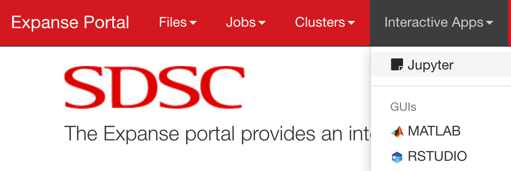
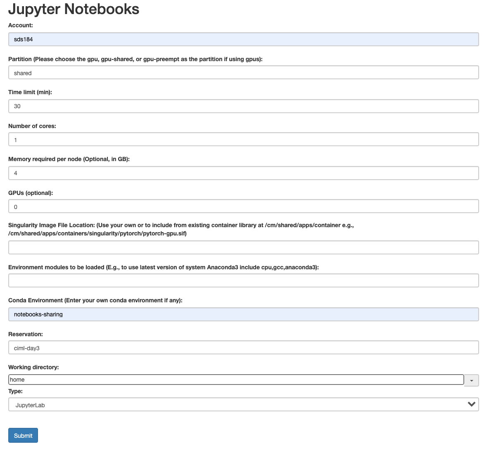
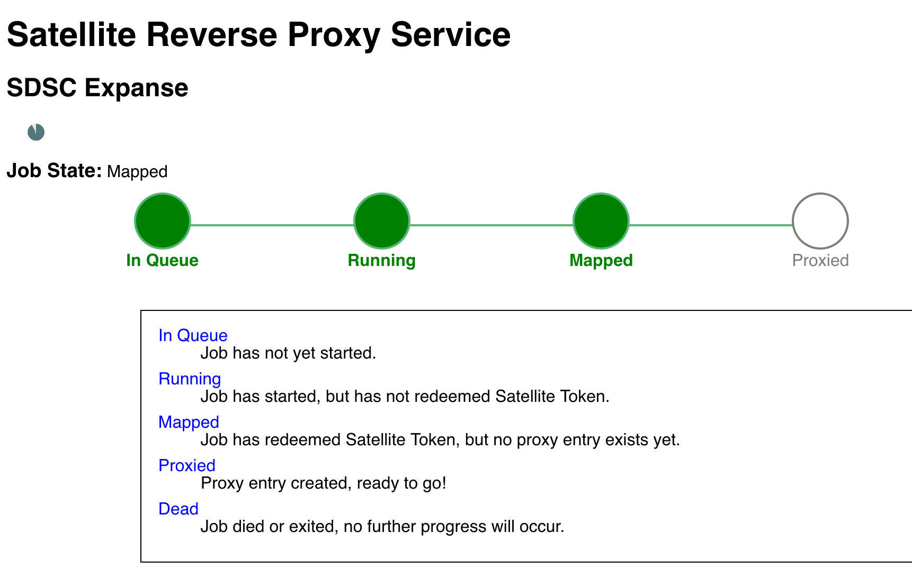
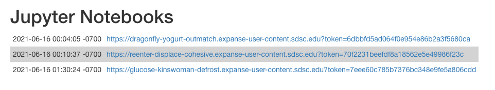
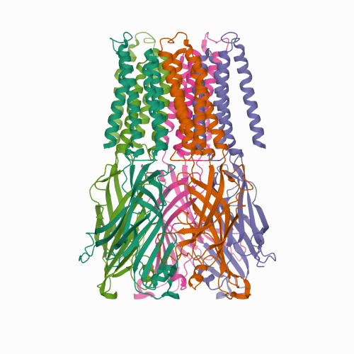
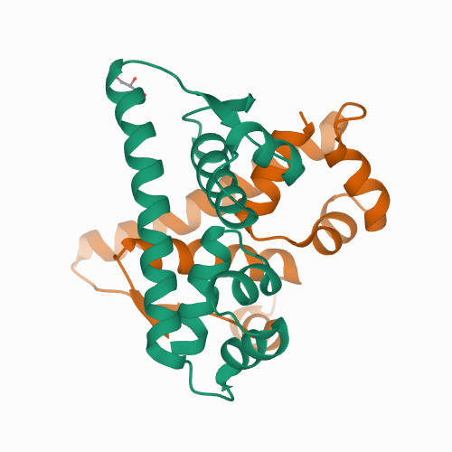

# 4.1_writing_and_sharing_computational_analyses_in_jupyter_notebooks/


## Agenda
1. Test your Conda Installation
2. Introduction
 * Brief introduction to ML model used for this project
 * Sharing Computational Analyses in Jupyter Notebooks
3. Run `notebooks-sharing` Conda Enviroment using the Expanse Portal
4. Make a prediction with the ML model
5. Share Notebooks in the public cloud using MyBinder

---

## Test your Conda Installation
Run the galyleo script to create a URL for your Jupyter session.
```
galyleo.sh launch --account sds184 --reservation 'ciml-day3' --partition 'shared' --cpus-per-task 1 --memory-per-node 4 --time-limit 01:00:00 --jupyter 'lab' --notebook-dir "/home/${USER}" --conda-env 'notebooks-sharing'
```

After you run this command, a URL is printed. Copy this URL and paste it into a web browser to launch your interactive session.

**If, and only if, the galyleo command fails**, run the following commands to add a preinstalled `notebooks-sharing` conda environment from xdtr99 to your .bashrc file.
```
echo "source /home/xdtr99/miniconda3/etc/profile.d/conda.sh" >> ~/.bashrc 
```
```
source ~/.bashrc 
```

Then, run the galyleo script again.

---

## Run the Jupyter Notebooks from the Expanse Portal

**1. Login to the Expanse Portal**

Use your XSEDE username (trainXX) and password to login to the portal.

[https://portal.expanse.sdsc.edu](https://portal.expanse.sdsc.edu)

**2. Select Jupyter from the `Interactive Apps` menu on the Expanse Portal.**

<p align="center">

</p>

**3. Specify your Job Parameters**

Fill in the following parameters in the jobs parameter page. Be careful use exactly the same options as shown in the image below. Double-check all options before you click the submit button.

<p align="center">

</p>

**4. Monitor the Job Status**

After you click submit, the next page shows a progress bar for your interactive session. Once all for stages are green, you will be directed to the next page.

<p align="center">

</p>


**5. Choose your Interactive Session**

Once the interactive session is active, select the session you want to launch from the list of your currently running sessions. The latest session appears at the bottom of the list.

<p align="center">

</p>

**6. Run Jupyter Lab**

Next, Jupyter Lab starts. Navigate to the `notebooks-sharing/notebooks` directory in the file browser.

Run the following notebooks:
* 1-CreateDataset.ipynb
* 2-CalculateFeatures.ipynb
* 3-FitModel.ipynb
* 4-Predict.ipynb

**7. Make a prediction**

Predict the protein fold class for one of the following proteins using the protein sequence.

**Structure 1**
<p align="center">

</p>

Source: [PDB:7L6U](https://www.rcsb.org/structure/7L6U)

```
APADNAADARPVDVSVSIFINKIYGVNTLEQTYKVDGYIVAQWTGKPRKTPGDKPLIVENTQIERWINNGLWVPALEFINVVGSPDTGNKRLMLFPDGRVIYNARFLGSFSNDMDFRLFPFDRQQFVLELEPFSYNNQQLRFSDIQVYTENIDNEEIDEWWIRGKASTHISDIRYDHLSSVQPNQNEFSRITVRIDAVRNPSYYLWSFILPLGLIIAASWSVFWLESFSERLQTSFTLMLTVVAYAFYTSNILPRLPYTTVIDQMIIAGYGSIFAAILLIIFAHHRQANGVEDDLLIQRCRLAFPLGFLAIGCVLVIRGITL
```

**Structure 2**
<p align="center">

</p>

Source: [PDB:7B5J](https://www.rcsb.org/structure/7B5J)

```
TNKELQAIRKLLMLDVSEAAEHIGRVSARSWQYWESGRSAVPDDVEQEMLDLASVRIEMMSAIDKRLADGERPKLRFYNKLDEYLADNPDHNVIGWRLSQSVAALYYTEGHADLI
```

**Structure 3**
<p align="center">

</p>

Source: [PDB:7O3I](https://www.rcsb.org/structure/7O3I)

```
GARSSSYSGEYGSGGGKRFSHSGNQLDGPITALRVRVNTYYIVGLQVRYGKVWSDYVGGRNGDLEEIFLHPGESVIQVSGKYKWYLKKLVFVTDKGRYLSFGKDSGTSFNAVPLHPNTVLRFISGRSGSLIDAIGLHWDVYPSSCSRC
```

**8. Use a different ML Model [optional]**

Build a Logistic Regression or Neural Network model and rerun the prediction.

---

## Share Notebooks using the MyBinder.org Service ##
Now, we want to host the `notebooks-sharing` repository on the MyBinder.org service, so the notebooks can be run anywhere, by anyone, in a web browser.

**1. Create a fork of the `notebooks-sharing` Git repository**

A fork is a copy of a repository in your GitHub account. Forking a repository allows you to freely experiment with changes without affecting the original project.

Log into your GitHub account and go to the repo: [https://github.com/sdsc-hpc-training-org/notebooks-sharing](https://github.com/sdsc-hpc-training-org/notebooks-sharing)

In the top-right corner of the `notebooks-sharing` GitHub page, click **Fork**.

**2. Create a Binder Badge using MyBinder.org**

Go to [MyBinder.org](https://mybinder.org/) and paste the GitHub URL of **your forked Git repository** into the form (and **do not** click the Launch button).

Expand the Binder Badge section at the bottom and copy the Markdown (first box).

**2. Add a Binder Badge to the README file in the forked repository**

Click the "pencil" to edit the README.md file
<p align="center">

</p>

Paste the Markdown for the Binder Badge into the README.md file (find placeholder).

Then append `?urlpath=lab` to the Binder Badge path. This instructs MyBinder to launch Jupyter Lab instead of Jupyter Notebook.

**3. Add a Binder Badge for the 4-Predict.ipynb Notebook**

Go back to the MyBinder form and add the path to notebook `notebooks/4-Predict.ipynb`.

Expand the Binder Badge section at the bottom and copy the Markdown (first box).

Paste the Markdown for the Binder Badge into the README.md file (find placeholder).

**4. Commit changes to your README.md file**

To save the README.md file, go to the bottom, enter a comment and click `Commit changes`.

**5. Launch Jupyter from the Binder Badge**

On your README.md page, click on the first badge. The MyBinder.org service will launch. The first time the service is launched, it will create a Docker image from the environment.yml file. This can take several minutes. Once this step is complete, Jupyter Lab will launch in your web browser. 

Now run the any of the notebooks to test them.

The next time you use this service, it will be faster since it uses the cached Docker image.


